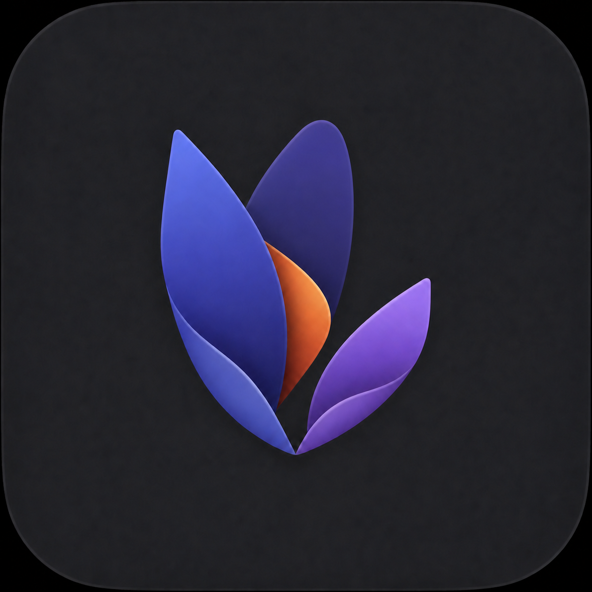

# Opium

Opium은 Mac에서 GGUF 형식의 로컬 LLM을 실행하고, 대화뿐 아니라 파일·터미널·메일·웹 도구를 사용할 수 있도록 만드는 네이티브 macOS 에이전트입니다.

대화와 모델은 사용자의 Mac에서 처리하는 것을 기본으로 합니다. 현재는 초기 개발 버전이며 `Qwen3.8-27B`를 중심으로 테스트하고 있습니다.



## 주요 기능

- SwiftUI 기반 네이티브 macOS 인터페이스
- GGUF 모델 자동 검색과 모델 전환
- `llama.cpp` 서버 자동 실행·종료
- 스트리밍 답변과 Markdown·코드 블록 렌더링
- 입력·출력 토큰, 생성 속도와 소요 시간 표시
- 파일 읽기·검색·작성과 변경 줄 수 표시
- 터미널 명령 실행과 결과 검증
- Apple Mail 검색과 웹페이지 읽기
- 작업별 폴더와 대화 기록 저장
- 실행 활동, 모델 메모리, 시스템 RAM 모니터링
- 작업 폴더와 도구별 권한 확인

## 요구 사항

- Apple Silicon Mac 권장
- macOS 15 이상
- Swift 6.2 이상
- [llama.cpp](https://github.com/ggml-org/llama.cpp)
- 실행할 GGUF 모델

## 시작하기

### 1. llama.cpp 설치

```bash
brew install llama.cpp
```

설치 후 다음 명령이 동작하는지 확인합니다.

```bash
llama-server --version
```

### 2. 모델 추가

저장소의 `Models` 폴더에 원하는 `.gguf` 파일을 넣습니다.

```text
Opium/
└── Models/
    └── your-model.gguf
```

모델 파일은 용량과 배포 조건 때문에 Git에 포함되지 않습니다. Q4 또는 Q5 양자화 모델로 먼저 테스트하는 것을 권장합니다.

48GB Apple Silicon Mac에서는 [`ggml-org/Qwen3.8-27B-GGUF`](https://huggingface.co/ggml-org/Qwen3.8-27B-GGUF)의 `Q4_K_M`을 권장합니다. Opium의 추론 단계는 Qwen3.8의 `low`, `medium`, `xhigh` 사고 강도와 연결됩니다.

### 3. 실행

```bash
swift run LocalAgent
```

첫 메시지를 보내면 선택한 모델이 자동으로 로드됩니다. 모델 로딩에는 Mac과 모델 크기에 따라 시간이 걸릴 수 있습니다.

## 권한과 안전

Opium은 읽기 작업과 변경 작업을 구분합니다.

- 파일 읽기와 검색은 기본적으로 바로 실행할 수 있습니다.
- 파일 작성, 이동, 삭제와 터미널 명령은 설정된 정책에 따라 승인을 요청합니다.
- 전체 액세스를 사용하더라도 앱이 표시하는 대상 경로와 작업 내용을 확인하는 것을 권장합니다.
- 메일 발송이나 중요한 외부 변경 기능은 아직 포함하지 않았습니다.

커뮤니티 모델이 생성한 명령은 항상 정확하거나 안전하다고 보장할 수 없습니다. 중요한 파일은 별도로 백업해 주세요.

## 모델 추가와 전환

새 GGUF 파일을 `Models` 폴더에 넣은 다음 입력창의 모델 메뉴에서 **모델 다시 찾기**를 선택합니다. 실행 중인 모델을 바꾸면 기존 서버를 종료하고 새 모델을 로드합니다.

모델별 채팅 템플릿과 도구 호출 형식이 다를 수 있으므로 모든 GGUF 모델의 에이전트 기능을 보장하지는 않습니다.

## 플러그인

왼쪽 사이드바의 **플러그인**에서 Codex 형식의 로컬 플러그인 폴더를 추가할 수 있습니다.

```text
my-plugin/
├── .codex-plugin/
│   └── plugin.json
├── skills/
│   └── my-skill/
│       └── SKILL.md
├── .mcp.json       # 선택
└── hooks/         # 선택
```

현재 버전은 활성화한 플러그인의 `SKILL.md` 지침을 모델에 적용합니다. MCP와 Hooks는 번들에 포함되었는지 표시하지만, 안전한 권한·샌드박스 런타임이 추가되기 전에는 자동 실행하지 않습니다.

## 검증

```bash
swift build
.build/debug/LocalAgent --self-test
```

## 데이터 저장

대화와 설정은 사용자의 Application Support 영역에 저장됩니다. 모델은 저장소의 `Models` 폴더 또는 앱 지원 폴더에서 검색합니다.

## 현재 상태

이 저장소는 제품화 전 프리뷰입니다. UI, 저장 형식, 권한 정책과 플러그인 구조는 변경될 수 있습니다. 자동화 작업은 중요한 데이터가 없는 테스트 폴더에서 먼저 사용해 주세요.

## 라이선스

아직 별도의 오픈소스 라이선스를 부여하지 않았습니다. 코드 사용·재배포 조건은 정식 공개 전에 추가할 예정입니다.
