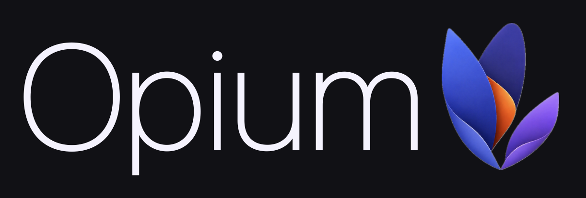
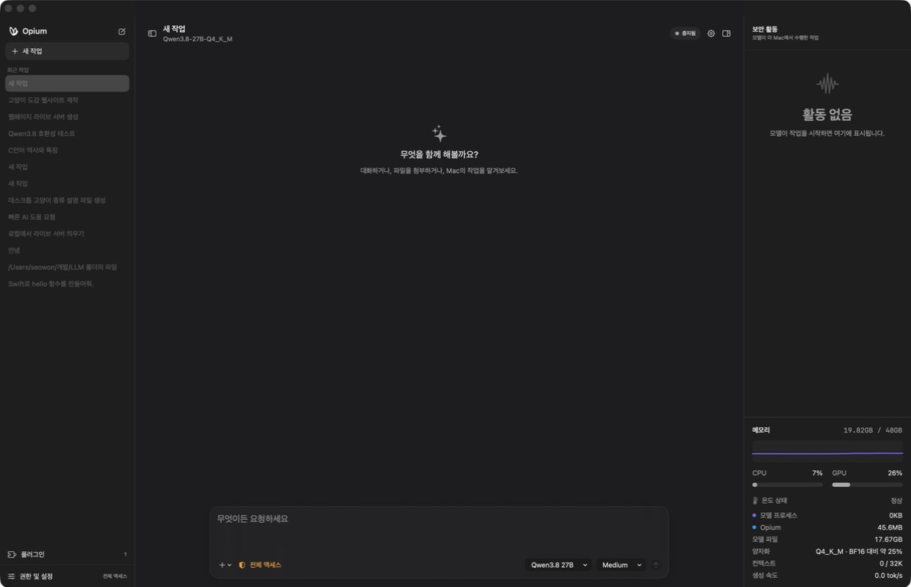
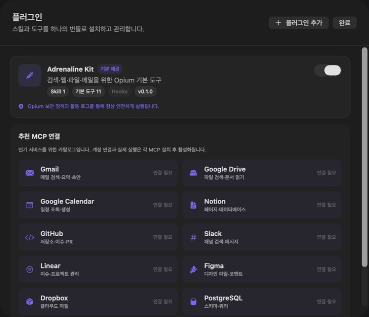

<div align="center">
  
  <p><strong>GGUF 모델을 실행하고 도구 호출까지 관리하는 네이티브 macOS 로컬 AI 에이전트 플랫폼</strong></p>
  <p>
    
    
    
    
  </p>
  <p><a href="https://github.com/yiseowon/Opium/releases/latest/download/Opium-macOS-arm64.zip"><strong>Apple Silicon용 Opium 다운로드</strong></a></p>
</div>

Opium은 Ollama·LM Studio와 같은 로컬 LLM 애플리케이션 범주에 속하지만, 모델 실행보다 **에이전트 작업**에 초점을 맞춥니다. GGUF 모델이 파일을 읽고 수정하고, 명령을 실행하고, 웹과 메일 도구를 호출하는 과정을 macOS 인터페이스에서 관리합니다.

모델 추론은 `llama.cpp`의 `llama-server`가 담당합니다. Opium은 LangChain·LangGraph·OpenAI Agents SDK를 사용하지 않고, 모델 요청 → 도구 호출 → 권한 검사 → 실행 → 결과 반환을 반복하는 에이전트 하네스를 Swift로 직접 구현했습니다. 현재 프리뷰 버전은 `Qwen3.8-27B Q4_K_M`을 기준으로 개발·검증하고 있습니다.

> [Opium 제품 소개 자료 보기](Docs/Opium-Product-Overview-Apple-Font.pptx) — 기술 구성, 작업 흐름, 권한 체계와 확장 구조를 7장의 슬라이드로 정리했습니다.



## 왜 Opium인가요?

### 로컬 모델을 실제 작업자로

단순 채팅뿐 아니라 파일 탐색·작성, 터미널 검증, 웹 검색과 Apple Mail 검색을 하나의 작업 흐름으로 연결합니다. 작업별 전용 폴더를 사용하고, 변경한 파일과 `+/-` 줄 수를 화면에 남깁니다.

### 무엇을 하는지 항상 보이게

모델의 내부 사고를 그대로 노출하는 대신 사용자가 이해할 수 있는 짧은 진행 설명, 현재 실행 중인 도구, 접근 경로, 보안 레벨과 결과를 표시합니다. 응답은 언제든 중단할 수 있고 다음 프롬프트를 예약해 이어서 실행할 수 있습니다.

### Mac 리소스까지 한 화면에서

모델 메모리, 시스템 RAM, CPU·GPU 사용률, 열 상태, 양자화와 컨텍스트 사용량을 실시간으로 확인할 수 있습니다.

## 주요 기능

- SwiftUI 기반 네이티브 macOS 인터페이스
- GGUF 모델 자동 검색, 전환, 로드와 언로드
- `llama.cpp` OpenAI 호환 스트리밍 추론
- Feather부터 Ultra까지 조절 가능한 추론 강도
- Markdown, 목록 카드, 복사 가능한 코드 블록 렌더링
- 턴 전체 토큰·생성 속도·소요 시간 통합 표시
- 응답 중단과 후속 프롬프트 예약
- 파일 읽기·검색·작성·이동·휴지통 처리
- 파일별 실시간 `+추가 / -삭제` 줄 수
- 터미널 명령 실행과 결과 검증
- 웹 검색·페이지 읽기와 Apple Mail 검색
- 경로와 작업 종류에 따른 3단계 보안 활동 로그
- 작업별 로컬 폴더와 대화 기록 저장
- 모델 및 시스템 리소스 모니터링
- 새 작업·프로젝트·반복 작업·예약 작업 기록
- 작업 이름 변경과 삭제를 위한 컨텍스트 메뉴
- 모델이 사용자 결정을 요청하는 선택지 카드
- Caffeine Kit 토큰 절약 지침과 Melatonin Kit 저전력 실행 모드

## 기술 구성

| 영역 | 구현 |
| --- | --- |
| 앱 | Swift 6.2, SwiftUI, AppKit |
| 추론 | `llama.cpp`의 `llama-server` 별도 프로세스 |
| 모델 | GGUF, 주 검증 모델 `Qwen3.8-27B Q4_K_M` |
| 모델 통신 | OpenAI 호환 HTTP API와 `URLSession` 스트리밍 |
| 에이전트 | Swift로 직접 구현한 반복형 도구 호출 하네스 |
| 도구 | 파일, 폴더, 터미널, 웹 검색·읽기, Apple Mail 검색 |
| 플러그인 | Codex 호환 `.codex-plugin/plugin.json`과 `SKILL.md` |
| 저장 | Codable JSON, Application Support, 작업별 로컬 폴더 |
| 관측 | Mach API, 프로세스 RSS, IORegistry 기반 리소스 측정 |

### 에이전트 하네스

```text
사용자 요청
  → 시스템·대화·플러그인 지침 구성
  → llama-server 스트리밍 요청
  → 텍스트 또는 tool_call 수신
  → Opium 권한 정책 검사
  → Swift 도구 실행
  → 실행 결과를 tool 메시지로 모델에 반환
  → 추가 도구 호출 또는 최종 응답
```

도구를 한 번 실행했다고 작업을 종료하지 않습니다. 실행 결과를 모델에 돌려보내고 요청이 완료될 때까지 같은 턴에서 후속 도구 호출을 이어갑니다. 응답 중단, 다음 프롬프트 예약, 파일별 변경량과 턴 전체 토큰 집계도 이 루프에서 관리합니다.

### 기능 구성

| 영역 | 제공 기능 | 사용자에게 보이는 결과 |
| --- | --- | --- |
| 대화 | 스트리밍 응답, Markdown, 코드 블록, 이미지·파일 첨부 | 사용자 메시지는 오른쪽, 모델 응답은 왼쪽에 명확히 구분 |
| 모델 | GGUF 검색·전환, 자동 로드, 명시적 언로드 | 입력창에서 모델을 바꾸고 로드 상태를 대화 안에서 확인 |
| 에이전트 | 파일, 터미널, 웹, 메일 도구 | 실행 전 설명 → 진행 상태 → 결과 카드 → 최종 요약 |
| 작업 기록 | 파일별 실시간 변경량, 명령 결과, 활동 로그 | 어떤 파일에 몇 줄이 추가·삭제됐는지 즉시 확인 |
| 제어 | 응답 중단, 후속 프롬프트 예약, 추론 강도 | 긴 작업을 멈추거나 다음 요청을 대기열에 추가 |
| 보안 | 경로·행동 기반 3단계 분류와 승인 정책 | 모델이 어디에 접근해 무엇을 했는지 색상별로 추적 |
| 관측 | 전체 토큰, 속도, 경과 시간, RAM·CPU·GPU | 모델의 비용과 Mac의 현재 부담을 한 화면에서 확인 |
| 확장 | Adrenaline Kit, 로컬 스킬, MCP 연결 카탈로그 | 필요한 도구만 선택하고 연결 상태를 명확히 관리 |

## 작업 흐름

1. 사용자가 요청을 보내면 메시지는 즉시 대화에 표시되고, 필요한 경우 모델을 백그라운드에서 로드합니다.
2. Opium은 작업 목적을 한두 줄로 설명하고 현재 접근 중인 폴더·도구·명령을 회색 진행 상태로 보여줍니다.
3. 파일 변경과 명령 실행은 활동 로그 및 보안 레벨에 기록되며, 정책상 필요한 작업만 구체적인 이유와 함께 승인을 요청합니다.
4. 실행 중에는 파일명별 `+추가 / -삭제` 값과 전체 토큰·속도·경과 시간이 갱신됩니다.
5. 작업이 끝나면 중간 출력은 정돈되고, 변경 파일·검증 결과·실행 방법을 포함한 최종 답변으로 마무리됩니다.

## 플러그인과 MCP

Opium은 Codex 형식의 로컬 플러그인 구조를 읽습니다. 기본 번들인 **Adrenaline Kit**은 파일·웹·메일 에이전트 도구를 Opium의 권한 및 활동 로그 안에서 제공합니다.



플러그인 화면에는 Gmail, Google Drive, Calendar, Notion, GitHub, Slack, Linear, Figma, Dropbox, PostgreSQL, Sentry, Stripe 등 인기 MCP 연결 카탈로그가 포함되어 있습니다. 카탈로그 항목은 실제 계정 또는 MCP 런타임이 연결되기 전까지 `연결 필요`로 명확히 표시됩니다.

```text
my-plugin/
├── .codex-plugin/
│   └── plugin.json
├── skills/
│   └── my-skill/
│       └── SKILL.md
├── .mcp.json       # 선택
└── hooks/          # 선택
```

현재는 활성화된 플러그인의 `SKILL.md`를 모델 지침에 적용합니다. 외부 MCP 프로세스와 Hooks는 안전한 실행 수명 주기와 권한 경계가 완성되기 전까지 자동 실행하지 않습니다.

## 시작하기

### 요구 사항

- Apple Silicon Mac
- macOS 15 이상
- [llama.cpp](https://github.com/ggml-org/llama.cpp)
- 실행할 GGUF 모델

### 1. Opium 설치

1. [최신 릴리스](https://github.com/yiseowon/Opium/releases/latest)에서 `Opium-macOS-arm64.zip`을 받습니다.
2. 압축을 풀고 `Opium.app`을 Applications 폴더로 이동합니다.
3. 최초 실행 시 Finder에서 앱을 Control-클릭한 뒤 **열기**를 선택합니다.

현재 프리뷰 빌드는 Developer ID 공증 전의 ad-hoc 서명 앱입니다. macOS의 Gatekeeper를 전역으로 해제하지 마세요. 정식 배포 전까지는 소스와 릴리스 파일을 확인한 뒤 사용해 주세요.

### 2. llama.cpp 설치

```bash
brew install llama.cpp
llama-server --version
```

### 3. 모델 추가

저장소의 `Models` 폴더에 `.gguf` 파일을 넣습니다.

```text
Opium/
└── Models/
    └── your-model.gguf
```

모델 파일은 크기와 배포 조건 때문에 Git에 포함되지 않습니다. 48GB Apple Silicon Mac에서는 [`ggml-org/Qwen3.8-27B-GGUF`](https://huggingface.co/ggml-org/Qwen3.8-27B-GGUF)의 `Q4_K_M`을 우선 권장합니다.

릴리스 앱은 다음 위치에서도 모델을 검색합니다.

```text
~/Library/Application Support/LocalAgent/Models/
```

해당 폴더가 없다면 직접 만든 뒤 `.gguf` 파일을 넣고, Opium의 모델 메뉴에서 **모델 다시 찾기**를 선택합니다.

### 소스에서 빌드

```bash
swift run LocalAgent
```

첫 메시지를 보내면 선택한 모델이 자동으로 로드됩니다. 새 모델을 추가한 뒤 입력창의 모델 메뉴에서 **모델 다시 찾기**를 선택하면 앱을 재설치하지 않고 전환할 수 있습니다.

### 모델 호환성

Opium은 특정 모델 하나에 고정되지 않고 `llama-server`가 읽을 수 있는 GGUF 모델을 대상으로 합니다. 다만 에이전트 작업의 품질은 모델의 도구 호출 형식, 컨텍스트 길이, 양자화 수준과 프롬프트 준수 능력에 따라 달라집니다.

- 현재 주 검증 모델: `Qwen3.8-27B Q4_K_M`
- 이전 호환 모델: `Qwen3-Coder-30B-A3B-Instruct Q4_K_M`
- 권장 런타임: 최신 안정 버전의 `llama.cpp`
- 메모리 여유가 적다면 더 작은 모델 또는 낮은 양자화를 선택하세요.

Feather, Light, Medium, High, Extra High, Ultra는 서로 다른 모델이 아니라 같은 모델에 부여하는 작업 예산과 실행 성향입니다. 단계가 높을수록 더 많은 검토와 도구 반복을 허용하지만, 모델 자체의 능력 한계를 넘어서는 것은 아닙니다.

## 기준 개발 및 검증 환경

Opium은 아래 MacBook Pro에서 `Qwen3.8-27B Q4_K_M`을 기준으로 개발하고 실제 에이전트 작업을 검증했습니다.

| 항목 | 사양 |
| --- | --- |
| 제품 | MacBook Pro (`Mac17,8`) |
| 칩 | Apple M5 Pro |
| CPU | 18코어 |
| 통합 메모리 | 48GB |
| 운영체제 | macOS 26.6.1 |
| 모델 | Qwen3.8-27B Q4_K_M |
| 런타임 | llama.cpp `llama-server` |
| 기본 컨텍스트 | 32K |
| 관찰된 생성 속도 | 약 10–13 tok/s |
| 실행 중 모델 RSS | 약 20.9GB |

생성 속도와 메모리 사용량은 llama.cpp 버전, 프롬프트 길이, 컨텍스트, 양자화와 백그라운드 작업에 따라 달라집니다. 48GB보다 적은 메모리에서는 더 작은 모델이나 양자화를 권장합니다.

### 검증한 작업

- Qwen3.8 모델 로드·스트리밍·명시적 언로드
- 연속 도구 호출과 파일 작성 후 재읽기
- 파일명별 실시간 `+추가 / -삭제` 집계
- 응답 중단과 후속 프롬프트 처리
- 32K 일반 모드와 16K Melatonin 모드 전환
- 작업 생성·이름 변경·삭제·저장·재실행
- 플러그인 검색과 기본 Kit 로드
- 모델 프로세스 종료 후 메모리 회수

## 권한과 안전

Opium은 읽기와 변경 작업을 구분하고, 실제 도구 실행을 보안 활동 로그에 남깁니다.

- 일반 작업 폴더 접근은 레벨 1로 분류합니다.
- 개인 데이터·웹·메일 접근은 레벨 2로 표시합니다.
- 터미널, 삭제, 시스템 민감 경로는 레벨 3으로 강조합니다.
- 파일 작성·이동·삭제와 터미널 명령은 선택한 정책에 따라 승인을 요청합니다.
- 전체 액세스는 Opium 내부 승인 질문을 생략하지만 macOS 자체 개인정보 보호 정책을 우회하지 않습니다.

커뮤니티 모델이 생성한 명령은 항상 정확하거나 안전하다고 보장할 수 없습니다. 중요한 파일은 백업하고, 처음에는 테스트 폴더에서 사용해 주세요.

## 개발 및 검증

```bash
swift build
.build/debug/LocalAgent --self-test
```

대화와 설정은 사용자의 Application Support 영역에 저장됩니다. 모델은 저장소의 `Models` 폴더와 앱 지원 폴더에서 검색합니다.

### 데이터와 작업 폴더

- 사용자가 작업 폴더를 지정하면 해당 폴더를 우선 사용합니다.
- 별도 폴더가 없으면 날짜별 전용 작업 폴더를 만들어 임시 결과가 프로젝트 루트에 흩어지지 않게 합니다.
- 대화 기록, 누적 토큰과 앱 설정은 로컬 Application Support에 저장합니다.
- 모델 파일과 사용자가 만든 작업 결과는 Git 커밋 대상에 자동으로 포함하지 않습니다.

## 브랜드

Opium의 대표 색상은 **Opium Purple `#7A61F5`**입니다. 앱의 강조 색상은 이 색상에서 명도·채도·투명도를 조절해 파생합니다.

## 현재 상태

Opium은 제품화 전 프리뷰입니다. UI, 저장 형식, 권한 정책과 플러그인 런타임은 변경될 수 있습니다.

## 라이선스

아직 별도의 오픈소스 라이선스를 부여하지 않았습니다. 코드 사용 및 재배포 조건은 정식 공개 전에 추가될 예정입니다.
